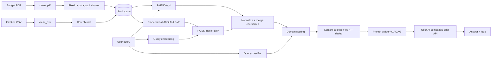

# Architecture — Academic City RAG

**Student:** Amegah Sewenam Kwame Bill
**Index:** 10022200079

## Overview

The system implements a **manual RAG pipeline** (no LangChain/LlamaIndex): documents are ingested, chunked, embedded with `sentence-transformers`, indexed in **FAISS**, augmented with **BM25**, merged through **hybrid retrieval** and **domain-specific scoring**, then passed to an **OpenAI-compatible API**.

## Data flow

## Components

| Layer | Role |
|--------|------|
| **ingestion** | `pandas` CSV load; PyMuPDF text extraction |
| **preprocessing** | Whitespace normalization; CSV row → NL chunks; PDF fixed (400w/80o) or paragraph-aware (300–500w) |
| **embedder** | `all-MiniLM-L6-v2`, L2-normalized vectors |
| **vector_store** | FAISS inner product on unit vectors (= cosine similarity) |
| **bm25_retriever** | `rank_bm25` lexical scores |
| **hybrid_retriever** | Union of candidates, min–max normalization per signal, weighted **domain score** |
| **scoring** | Combines vector, BM25, source-match, keyword overlap, year/numeric bonuses |
| **prompt_builder** | Three prompt variants; production default emphasizes grounding and refusal |
| **llm_client** | OpenAI-compatible client (`openai` SDK), supports Groq/OpenAI via `OPENAI_BASE_URL` |
| **rag_pipeline** | Orchestrates build/load, retrieval, selection, generation, logging |
| **evaluation** | Heuristic metrics + RAG vs pure LLM comparison |
| **app.py** | Streamlit UI: chunks, scores, prompt, answer |

## Diagram placeholder

_Add your course diagram image here (e.g. `docs/diagram.png`) and reference it in the report._

## Interaction

1. **Build index** computes chunks once and writes `outputs/chunks.json`, `outputs/faiss.index`, `outputs/index_meta.json`.
2. **Query** runs hybrid retrieval → **top 4** context after deduplication → prompt → LLM API call.
3. **Logging** appends structured entries to `outputs/logs.json`.

## Innovation: domain-specific scoring

Final score is a weighted blend of normalized dense and sparse retrieval plus bonuses when the query type aligns with the document source, when query terms overlap chunk text (Jaccard), and when years in the query appear in chunk metadata or body. See `src/retrieval/scoring.py`.
