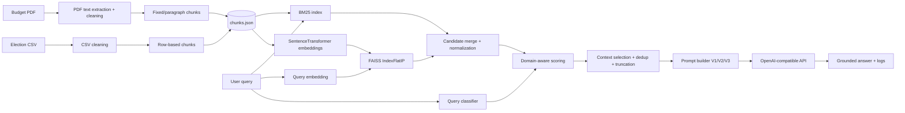
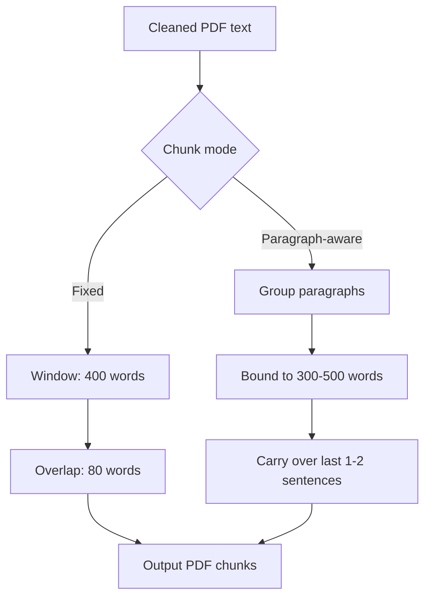
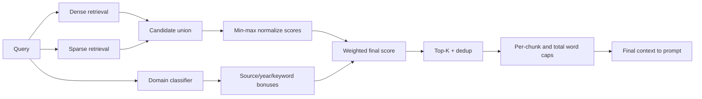
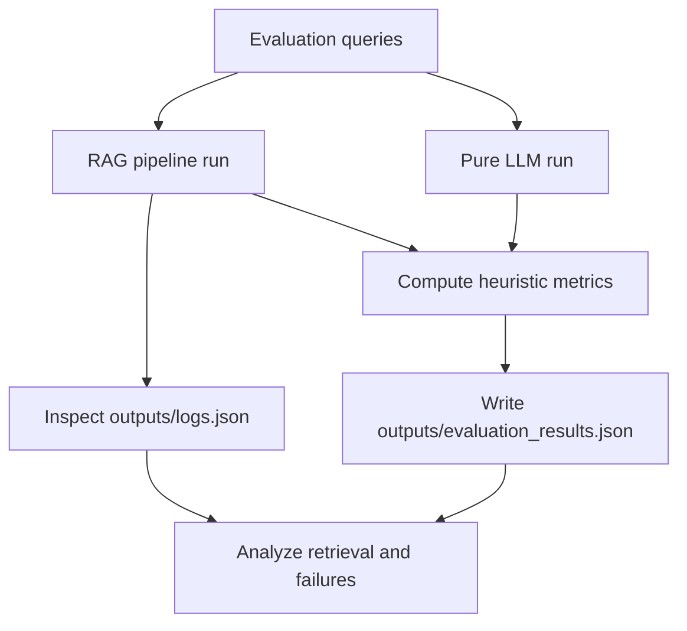

# Retrieval-Augmented Generation for Ghana Election and Budget Question Answering

**Student:** Amegah Sewenam Kwame Bill  
**Index:** 10022200079  
**Course:** CS4241 Introduction to Artificial Intelligence  
**Institution:** Academic City University

## Abstract

This report documents the design, implementation, and evaluation of a manual Retrieval-Augmented Generation (RAG) system developed for factual question answering over two heterogeneous sources: Ghana election records in CSV format and a 2025 budget statement in PDF format. The implementation intentionally avoids orchestration abstractions and directly builds each stage of the pipeline: ingestion, cleaning, chunking, embedding, indexing, retrieval, reranking, context assembly, prompting, and response generation.

The retrieval architecture combines dense similarity search (FAISS over L2-normalized sentence embeddings) with sparse lexical retrieval (BM25) and then applies domain-aware reranking signals to prioritize evidence that matches query intent and factual constraints. Evaluation is performed by comparing RAG against a pure LLM baseline on the same question set, using heuristic metrics for numeric grounding, hedge/refusal behavior, and output consistency, supplemented by adversarial tests (for example, wrong-year prompts).

The key contribution is not only the use of hybrid retrieval, but the explicit engineering controls added around retrieval quality: source-aware bonuses, overlap-aware chunking, deduplication, and context budget governance. These controls are critical for reducing cross-domain retrieval errors and improving answer faithfulness on number-heavy public-policy questions.

## 1. Introduction

Large language models provide high fluency, but they do not guarantee faithful factual recall when asked about specific historical outcomes or budget figures. This weakness is amplified in mixed corpora where:
- one source is structured and row-oriented (election table),
- another source is long narrative text (budget PDF),
- questions often depend on exact numbers and years.

In this setting, a strong answer is not merely grammatical; it must be traceable to retrieved evidence. The central research problem in this project is therefore:

**How can a lightweight, framework-free RAG system improve factual grounding over mixed-format civic datasets while remaining transparent enough for inspection and coursework demonstration?**

The system objectives were defined as:
1. Preserve high factual precision for election rows and fiscal figures.
2. Reduce hallucinations relative to pure generation.
3. Handle cross-domain prompts (election-only, budget-only, and mixed intent).
4. Expose retrieval internals (scores, selected chunks, logs) for debugging and evaluation.

## 2. System Design and Methodology

### 2.1 End-to-End Architecture

The implementation follows a deterministic data path from source documents to grounded responses.

Implementation characteristics:
- **Manual orchestration:** each pipeline stage is explicit in project modules rather than hidden behind framework chains.
- **Persistent artifacts:** chunks, FAISS index, metadata, and logs are stored in `outputs/` for reproducibility.
- **Inspectable inference:** retrieved chunks and score signals are available in the Streamlit UI and logs.

### 2.2 Data Ingestion and Preprocessing

#### 2.2.1 Election CSV Processing

Election data is loaded through `pandas` and normalized into natural-language chunks where each row remains one factual unit. This decision is deliberate:
- a row already encodes one atomic observation (year, constituency/region, candidate, party, vote count/share),
- merging rows introduces entity drift and harms precision on exact lookup questions,
- one-row chunking makes citation and error tracing straightforward.

Each generated chunk is augmented with metadata fields used later in retrieval and scoring, including:
- `chunk_id`
- `source` (e.g., election/budget)
- `chunk_type`
- `year` (when inferable)
- `keywords`

#### 2.2.2 Budget PDF Processing

PDF text is extracted with PyMuPDF, then cleaned to reduce OCR and formatting artifacts (whitespace compaction, line-join normalization). Two chunking modes were implemented so retrieval behavior can be compared rather than assumed.

### 2.3 Chunking Design and Justification

#### 2.3.1 Fixed-size PDF Chunking

- Window size: **400 words**
- Overlap: **80 words** (20%)

Why 400/80:
- 400 words is large enough to preserve a full policy statement, subheading context, and nearby numbers.
- 80-word overlap protects against boundary loss where a claim starts at the end of one chunk and completes in the next.
- The fixed window also stabilizes embedding distribution and makes runtime predictable.

#### 2.3.2 Paragraph-aware PDF Chunking

- Target range: **300 to 500 words**
- Overlap mechanism: sentence-tail carryover (last 1-2 sentences, capped)

Why paragraph-aware:
- Budget documents are semantically sectioned; paragraph boundaries often encode topic shifts.
- Respecting structure tends to reduce topical mixing inside a chunk.
- Size constraints prevent over-fragmented short chunks and over-broad long chunks.

### 2.4 Indexing and Retrieval Stack

#### 2.4.1 Dense Retrieval

Text chunks are embedded with `all-MiniLM-L6-v2`. Vectors are L2-normalized before indexing. FAISS `IndexFlatIP` is then used for inner-product search, which becomes cosine similarity on normalized vectors:

\[
\text{cosine}(q, d) = \frac{q \cdot d}{\lVert q \rVert \lVert d \rVert}
\]

Using FAISS provides:
- fast top-k nearest-neighbor retrieval,
- predictable latency for interactive UI usage,
- compatibility with explicit score inspection.

#### 2.4.2 Sparse Retrieval

BM25 over tokenized chunk text complements dense retrieval by recovering keyword-sensitive matches (for example, exact fiscal terms and named entities) that embedding similarity can underweight.

#### 2.4.3 Hybrid Candidate Construction

Dense and sparse candidates are merged by union, then each signal is normalized (min-max) before final weighted scoring. This prevents one raw score range from dominating the ranking.

### 2.5 Domain-Aware Reranking

After normalization, ranking is adjusted using targeted bonuses:
- **source-match bonus:** increases score when query intent (election/budget/mixed) aligns with chunk source,
- **keyword overlap bonus:** rewards lexical intersection between query and chunk (Jaccard-like signal),
- **year/numeric bonus:** rewards chunks containing query-relevant years or numbers.

This reranking layer addresses a common failure mode in civic corpora: lexical overlap on generic national terms (for example, "Ghana", "2020") producing semantically wrong-source retrieval.

### 2.6 Context Window Governance

The project does not pass all retrieved text directly to the LLM. Instead, it applies explicit constraints:
- `max_context_chunks`
- `per_chunk_max_words`
- `total_context_max_words`
- near-duplicate filtering during selection

These controls reduce prompt bloat, keep evidence density high, and improve response determinism under token limits.

### 2.7 Prompting and Generation

Three prompt versions (V1/V2/V3) are used to test grounding strictness and refusal behavior. Compared with a generic QA prompt, the stronger templates:
- force the model to rely on provided context,
- discourage unsupported numerical claims,
- require uncertainty/refusal when evidence is insufficient.

Generation is provider-agnostic via OpenAI-compatible endpoints, allowing Groq or OpenAI backends through `.env` configuration.

## 3. Evaluation Methodology

### 3.1 Experimental Setup

Evaluation compares:
- **RAG mode:** query plus retrieved context
- **Pure mode:** same model and similar prompt intent, but no retrieval context

This controls for model family while isolating the effect of retrieval.

Execution entry point:
- `python -m src.evaluation.run_evaluation`

Primary outputs:
- `outputs/evaluation_results.json`
- `outputs/logs.json` (interaction-level diagnostics)

### 3.2 Metrics

The project uses practical heuristic metrics appropriate for coursework:

1. **Numeric Overlap (`numeric_overlap_*`)**  
   Share of numeric tokens in the model answer that also occur in available evidence context.

2. **Hedge/Refusal Flag (`hedge_*`)**  
   Binary signal indicating whether output contains refusal/uncertainty language.

3. **Consistency Jaccard (`consistency_jaccard_tokens`)**  
   Token-set similarity between repeated runs of the same query.

These are not substitutes for formal factuality benchmarks; they are operational indicators that make failure analysis faster and auditable.

### 3.3 Adversarial Probes

Adversarial tests intentionally stress retrieval and generation boundaries:
- wrong-year prompts,
- underspecified budget queries,
- domain-confusion prompts mixing election and budget terms.

Desired behavior is correction or refusal, not confident fabrication.

## 4. Results and Detailed Observations

Based on project evaluation notes and logs, the observed behavior pattern is:

1. **Numeric grounding improves under RAG**  
   When retrieval selects appropriate election rows or budget sections, answers include numbers that are traceable to context.

2. **Pure generation remains fluent but less reliable**  
   In no-context mode, the model can output plausible yet unsupported values, especially on specific fiscal values and year-specific comparisons.

3. **Prompt strictness matters**  
   Stronger prompt variants improve refusal behavior when context does not support a claim.

4. **Chunking strategy affects retrieval precision**  
   Paragraph-aware chunking often improves thematic questions in budget analysis, while fixed windows can perform better when repeated key phrases dominate.

5. **Hybrid retrieval outperforms single-signal retrieval qualitatively**  
   BM25 recovers exact term matches missed by embeddings, while dense retrieval captures semantically similar phrasing beyond exact keywords.

## 5. Error Analysis and Mitigation

### 5.1 Representative Failure Case

Failure pattern:
- query language suggests budget domain,
- dense similarity returns election chunks due to generic token overlap,
- final answer risks mixed-source contamination.

### 5.2 Root Cause

Dense embeddings can over-associate broad country/year language, especially when multiple sources share named entities and temporal markers.

### 5.3 Mitigation Applied

Implemented controls:
1. Query classification (`election`, `budget`, `mixed`)
2. Source-match reranking bonus
3. BM25 reinforcement for lexical specificity
4. Context deduplication and thresholding

These interventions shift top-ranked evidence toward source-consistent chunks and reduce cross-domain leakage in final responses.

## 6. Reproducibility and Deployment

### 6.1 Local Reproduction Steps

1. Install dependencies and activate virtual environment.
2. Configure `.env` with:
   - `OPENAI_API_KEY`
   - optional `OPENAI_BASE_URL`
   - `OPENAI_MODEL`
3. Ensure data files exist:
   - `data/Ghana_Election_Result.csv`
   - `data/2025_Budget_Statement.pdf`
4. Start app: `python -m streamlit run app.py`
5. Run evaluation: `python -m src.evaluation.run_evaluation`

### 6.2 Deployment Considerations

- Keep secrets out of version control.
- Use host-managed secret injection (for example, Streamlit Cloud secrets).
- Persist evaluation outputs and logs for post-deployment auditing.
- Rebuild index when source data changes to avoid stale retrieval artifacts.

## 7. Discussion

### 7.1 Technical Contributions

The most significant engineering contribution is the explicit combination of:
- hybrid retrieval,
- source-aware reranking,
- context-budget governance,
- transparent logging and UI inspection.

Together, these choices turn RAG from a black-box pattern into a diagnosable system where retrieval failures can be traced and fixed.

### 7.2 Limitations

1. Current metrics are heuristic and should be expanded with manual factuality annotation.
2. Results reporting remains partly qualitative until all benchmark runs are filled with final numeric tables.
3. The pipeline depends on chunk quality; PDF extraction noise can still degrade retrieval.

### 7.3 Future Work

1. Train or integrate a learned reranker on domain query-chunk relevance pairs.
2. Add citation spans in generated answers for stronger verifiability.
3. Expand adversarial suite and include calibration/error bars across repeated runs.
4. Introduce human evaluation rubric for factual correctness, completeness, and justified refusal.

## 8. Viva/Walkthrough Mapping

A strong 5-8 minute walkthrough should cover:
1. Problem setup and dataset heterogeneity.
2. Manual pipeline implementation (no chain framework).
3. Live retrieval inspection (chunk texts and score components).
4. Prompt version comparison and refusal behavior.
5. Evaluation execution and interpretation.
6. One failure case plus concrete mitigation evidence.
7. Deployment and secret management practices.

## 9. Conclusion

This project delivers a complete, inspectable RAG system for factual QA on mixed-format civic data. The design demonstrates that grounding improvements come not from retrieval alone, but from careful integration of chunking policy, dual-signal retrieval, domain-aware reranking, and context controls. The produced artifacts (indices, logs, evaluation outputs) provide a reproducible baseline for both coursework demonstration and continued research development.

## References

1. Project overview and setup: `README.md`  
2. System architecture details: `docs/architecture.md`  
3. Evaluation design notes: `docs/evaluation_report.md`  
4. Chunking and retrieval experiments: `docs/experiment_logs.md`  
5. Walkthrough structure and demo checklist: `docs/walkthrough_notes.md`

